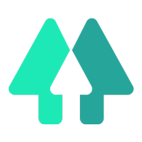

<div id="top"></div>

[![Forks][forks-shield]][forks-url]
[![Stargazers][stars-shield]][stars-url]
[![MIT License][license-shield]][license-url]
[![LinkedIn][linkedin-shield]][linkedin-url]

<!-- PROJECT LOGO -->
<br />
<div align="center">
  <a href="https://github.com/rinaldilucas/improved-linktree-example">
    
  </a>

  <h3 align="center">Improved Link Tree example</h3>

  <p align="center">
    An awesome Linktree example to jumpstart <br>your studies or start your business.
    <br />
    <br />
    <a href="https://github.com/rinaldilucas/improved-linktree-example"><strong>Explore the docs »</strong></a>
    <br />
    <a href="https://rinaldilucas.github.io/improved-linktree-example/">Open</a>
    ·
    <a href="#donations">Donate</a>
  </p>
</div>

<!-- TABLE OF CONTENTS -->
<details>
  <summary>Table of Contents</summary>
  <ol>
    <li>
      <a href="#about-the-project">About The Project</a>
      <ul>
        <li><a href="#built-with">Built With</a></li>
      </ul>
    </li>
    <li>
      <a href="#getting-started">Getting Started</a>
      <ul>
        <li><a href="#prerequisites">Prerequisites</a></li>
        <li><a href="#installation">Installation</a></li>
      </ul>
    </li>
    <li><a href="#usage">Usage</a></li>
    <li><a href="#contributing">Contributing</a></li>
    <li><a href="#license">License</a></li>
    <li><a href="#contact">Contact</a></li>
    <li><a href="#donations">Donations</a></li>
  </ol>
</details>

<!-- ABOUT THE PROJECT -->

## About The Project

<div align="center">

  [![Project Screenshot][project-screenshot]](https://rinaldilucas.github.io/improved-linktree-example/)
</div>

There are many great linktrees examples available on Internet, however, I didn't find one that really suited my need, so I created this enhanced one using stacks that I wanted to practice. This is actually the sum of all my learning right now. If this project helped you in any way, don't hesitate to leave a star!

<p align="right">(<a href="#top">back to top</a>)</p>

### Built With

This section shows what technologies are used in this particular project.

-   [Yarn](https://yarnpkg.com/)
-   [Handlebars.js](https://handlebarsjs.com/)
-   [Marionette.js](https://marionettejs.com/)
-   [Sass](https://sass-lang.com/)
-   [JQuery](https://jquery.com)

<p align="right">(<a href="#top">back to top</a>)</p>

<!-- GETTING STARTED -->

## Getting Started

After cloning the project, you need to do a few things to be able to run it.

### Prerequisites

You need to have the following requirements:

-   node 14 <a target="_blank" href="https://nodejs.org/en/download/">(download here)</a>

-   npm
    ```sh
      npm install -g npm
    ```
-   yarn
    ```sh
      npm install -g yarn
    ```
-   grunt cli
    ```sh
      npm install -g grunt-cli
    ```

### Installation

_Below is an example of how you can run the project._

1. Clone the repo
    ```sh
    git clone https://github.com/rinaldilucas/improved-linktree-example.git
    ```
2. Install the dependencies via yarn
    ```sh
    yarn install
    ```
3. Build the project to develop
    ```js
    grunt dev
    ```
4. Build the dist folder
    ```js
    grunt build --tiny-key={KEY}
    ```

<p align="right">(<a href="#top">back to top</a>)</p>

<!-- USAGE EXAMPLES -->

## Usage

To facilitate customization, I put some settings in the data.json file. Thus, you will be able to change the internal data of the site without having to code. Check [CONFIG](./CONFIG.txt) for more details.

_For convenience, I put the data.json in the root of the project._

<p align="right">(<a href="#top">back to top</a>)</p>

<!-- CONTRIBUTING -->

## Contributing

Contributions are what make the open source community such an amazing place to learn, inspire, and create. Any contributions you make are **greatly appreciated**.

If you have a suggestion that would make this better, please fork the repo and create a pull request. You can also simply open an issue with the tag "enhancement".
Don't forget to give the project a star! Thanks again!

1. Fork the Project
2. Create your Feature Branch (`git checkout -b feature/amazing-feature`)
3. Commit your Changes (`git commit -m 'feat: add some amazing feature'`)
4. Push to the Branch (`git push origin feature/amazing-feature`)
5. Open a Pull Request

<p align="right">(<a href="#top">back to top</a>)</p>

<!-- LICENSE -->

## License

Distributed under the MIT License. See [LICENSE](./LICENSE) for more information.

<p align="right">(<a href="#top">back to top</a>)</p>

<!-- CONTACT -->

## Contact

[](https://rinaldilucas.com)
[](https://github.com/rinaldilucas)
[](mailto:lucasreinaldi@gmail.com)
[](mailto:lucasreinaldi@hotmail.com)
[](https://www.linkedin.com/in/rinaldilucas/)
[](https://t.me/rinaldilucas)

Project Link: [https://github.com/rinaldilucas/improved-linktree-example](https://github.com/rinaldilucas/improved-linktree-example)

<p align="right">(<a href="#top">back to top</a>)</p>

<!-- ACKNOWLEDGMENTS -->

## Donations

If you feel that this project has helped you in any way, whether it's attracting clients or teaching you about the technologies used, feel free to make a donation.
It helps me a lot to continue developing open source codes.

-   Metamask (USDT):
    ```sh
    0xA0410641515F06fF6a9AdAFf1c3e90a3905ba271
    ```
-   PIX (BRL):
    ```sh
    72140bc8-fadc-42f5-abb6-9c13cc80a59f
    ```

<p align="right">(<a href="#top">back to top</a>)</p>

<!-- MARKDOWN LINKS & IMAGES -->
<!-- https://www.markdownguide.org/basic-syntax/#reference-style-links -->

[forks-shield]: https://img.shields.io/github/forks/rinaldilucas/improved-linktree-example.svg?style=for-the-badge
[forks-url]: https://github.com/rinaldilucas/improved-linktree-example/network/members
[stars-shield]: https://img.shields.io/github/stars/rinaldilucas/improved-linktree-example.svg?style=for-the-badge
[stars-url]: https://github.com/rinaldilucas/improved-linktree-example/stargazers
[license-shield]: https://img.shields.io/github/license/rinaldilucas/improved-linktree-example.svg?style=for-the-badge
[license-url]: https://github.com/rinaldilucas/improved-linktree-example/blob/main/LICENSE
[linkedin-shield]: https://img.shields.io/badge/-LinkedIn-black.svg?style=for-the-badge&logo=linkedin&colorB=555
[linkedin-url]: https://www.linkedin.com/in/rinaldilucas/
[project-screenshot]: ./sources/images/_readme/screenshot.jpg
